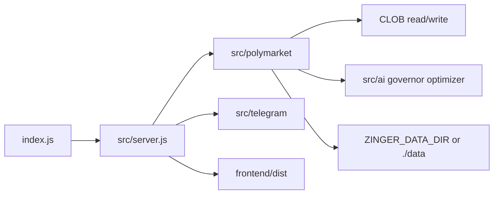

# Architecture (Core)

High-level map of the public Core tree. No hostnames, wallets, or live ledgers.

## Process

## Polymarket bot

- Market discovery and window timing (`markets.js`, `windows.js`)
- Signals / ML hooks (`signal.js`, `predict.js`, `onnxInference.js`)
- Sizing and exits (`kelly.js`, `trade.js`, `fees.js`)
- Paper vs live isolation (`modeConfig.js`)
- Persistence under `data/` via `persistence.js` (local only; not shipped)

## Operator UI

Vite app in `frontend/`, built to `frontend/dist`, served by Express (dashboard at `/poly`).

## ML

Python scripts under `ml/` train or export models. Weights and parquet datasets are operator-managed under `data/ml/` (ignored by git).
